# Mini Music App

This repository contains the source code for the Mini Music App, a streaming application with a React Native frontend and a Node.js (Bun) backend.

## Builds & Demos

- [**Download the latest Android build from Expo**](https://expo.dev/accounts/tejasnasre/projects/mini-music/builds/8e3953b9-1576-4817-8e7a-f2f224e699b9) (or from [**GitHub Releases**](https://github.com/tejasnasre/Mini-Music-App/releases/download/apk/application-8e3953b9-1576-4817-8e7a-f2f224e699b9))
- [**Watch the demo video**](https://drive.google.com/file/d/10OKeSHLMlXPyfaHLYxBGllhsxfGG7vdy/view?usp=sharing)

## Getting Started

Follow these instructions to get the project up and running on your local machine for development and testing purposes.

### Prerequisites

Before you begin, ensure you have the following installed:

- [Node.js](https://nodejs.org/) (LTS version recommended)
- [Bun](https://bun.sh/) - A fast JavaScript all-in-one toolkit.

### Installation & Running the Project

The project is split into two main parts: the `app` (frontend) and the `backend`. You will need to run them in separate terminal windows.

---

### 1. Backend Setup

The backend is a Node.js server built with Express and Bun. It serves the API for tracks, artists, and streaming content.

1.  **Navigate to the backend directory:**

    ```bash
    cd backend
    ```

2.  **Install dependencies:**

    ```bash
    bun install
    ```

3.  **Run the development server:**
    ```bash
    bun run dev
    ```

The backend server will start, and you should see output indicating it's running, typically on `http://localhost:3000`.

---

### 2. Frontend (App) Setup

The frontend is a React Native application built with Expo.

1.  **Navigate to the app directory:**

    ```bash
    cd app
    ```

2.  **Install dependencies:**

    ```bash
    bun install
    ```

3.  **Run the application:**
    You can run the app on Android, iOS, or in a web browser.
    - **For Android:**

      ```bash
      bun run android
      ```

    - **For iOS:**

      ```bash
      bun run ios
      ```

    - **For Web:**
      ```bash
      bun run web
      ```

This will start the Expo development server and launch the app in the selected environment. If you're running on a mobile device, you'll need the Expo Go app installed.

---

### 3. Building the App with EAS

To create a standalone build of the application for distribution, we use [Expo Application Services (EAS)](https://expo.dev/eas).

1.  **Install the EAS CLI:**
    If you don't have it installed, you can install it globally:

    ```bash
    npm install -g eas-cli
    ```

2.  **Log in to your Expo account:**

    ```bash

    ```

    eas login

````

3.  **Configure the build:**
  The `eas.json` file in the `app` directory is pre-configured for different build profiles.

4.  **Start the build:**
  You can build for Android or iOS using the following commands from the `app` directory:
  - **Android (APK):**

    ```bash
    cd app
    eas build --profile preview --platform android
    ```

  - **iOS:**
    ```bash
    cd app
    eas build --profile preview --platform ios
    ```

---

## Diagrams

### Audio Streaming Methods



### HLS Streaming Workflow



### Client - Server Workflow



## Approach and Project Structure

## References

- [HLS Audio Streaming in Node.js](https://medium.com/@sandipbasnet/hls-audio-streaming-in-node-js-f89501c86a21)
- [Broadcasting and Streaming Live Audio Using Node.js, FFmpeg, React, and React Native](https://medium.com/@mustneerahmadr7/broadcasting-and-streaming-live-audio-using-node-js-ffmpeg-react-and-react-native-09604f0937f0)

### Backend

The `backend` is a standard Node.js application using Express.js. It's responsible for serving artist and track metadata, as well as handling the streaming of audio content via HLS.

- **`src/`**: Contains all the source code.
- **`config/`**: Environment variable management.
- **`data/`**: Static JSON files (`artists.json`, `tracks.json`) acting as a simple database.
- **`routes/`**: Defines the API endpoints for different resources (artists, tracks, feed, HLS).
- **`services/`**: Business logic for fetching and processing data.
- **`temp/chunks/`**: Stores the pre-generated HLS (`.m3u8`, `.ts`) files for streaming.
- **`utils/`**: Contains the `mp3tochunks.js` script used to convert MP3 files into HLS format.
- **`index.ts`**: The main entry point for the Express server.

### Frontend (App)

The `app` is a React Native mobile application built with Expo and Expo Router for navigation. It consumes the API provided by the backend to display music and handle playback.

- **`src/`**: Contains all the application source code.
- **`app/`**: The main directory for the Expo Router, where file-based routing is defined.
  - **`(app)/`**: The main application layout and screens (e.g., `index.tsx`, `player.tsx`).
  - **`(auth)/`**: Authentication-related screens.
  - **`_layout.tsx`**: Defines the root layout for the app.
- **`lib/`**: Contains API fetching logic and other utility functions.
- **`store/`**: Global state management using Zustand for authentication, favorites, and the music player.
- **`types/`**: TypeScript type definitions for data structures like `Track` and `Artist`.
- **`global.css`**: Global stylesheet for Tailwind CSS (via Uniwind).

---

## Key Decisions and Tradeoffs

Based on the project's evolution, here are some of the key technical decisions and the tradeoffs involved:

1.  **Streaming Architecture: HTTP Range Requests → HLS**
  - **Initial Approach**: The backend first implemented streaming using HTTP `Range` requests. This is a straightforward method for serving media, allowing the client to request parts of a file.
  - **Final Approach**: The architecture was later migrated to **HLS (HTTP Live Streaming)**.
  - **Tradeoff**: HLS is more complex, requiring a one-time `ffmpeg` process to segment audio files into `.ts` chunks and create `.m3u8` playlists. However, it offers significant advantages for a music app, including **adaptive bitrate streaming** (which adjusts quality based on network conditions), better client-side caching, and improved reliability on mobile networks. The current implementation simplifies the backend by pre-generating these files, making the server's job to just serve static content.

2.  **Data Storage: JSON Files vs. Database**
  - **Decision**: The backend uses static JSON files (`artists.json`, `tracks.json`) located in the `src/data` directory to store metadata.
  - **Tradeoff**: This approach is simple, has zero setup cost, and is perfectly adequate for a small, fixed dataset, making the project easy to run locally. The tradeoff is a lack of scalability and dynamic content management. A full-fledged database (like PostgreSQL or MongoDB) would be necessary to handle a larger library of music, user data, and dynamic updates.

3.  **UI Component Library: HeroUI with Uniwind**
  - **Decision**: The frontend uses `heroui-native`, a component library that leverages `uniwind` to enable Tailwind CSS-like styling in React Native.
  - **Tradeoff**: This provides a rapid development experience with a consistent, utility-first styling system. It avoids the need to write custom stylesheet objects for every component. The tradeoff is a dependency on a specific styling paradigm and library, and a potential learning curve for those unfamiliar with Tailwind CSS.

4.  **State Management: Zustand and Local Persistence**
  - **Decision**: Global state for features like the music player and favorites is managed with Zustand. For persistence (e.g., saving favorite tracks), the app uses local storage (likely via `react-native-mmkv`).
  - **Tradeoff**: Zustand offers a simple and powerful way to manage state without the boilerplate of other libraries. Using local storage for persistence is fast and works offline. However, this data is not synced across devices. A complete solution would require a backend service to store user-specific data like favorites.
````
